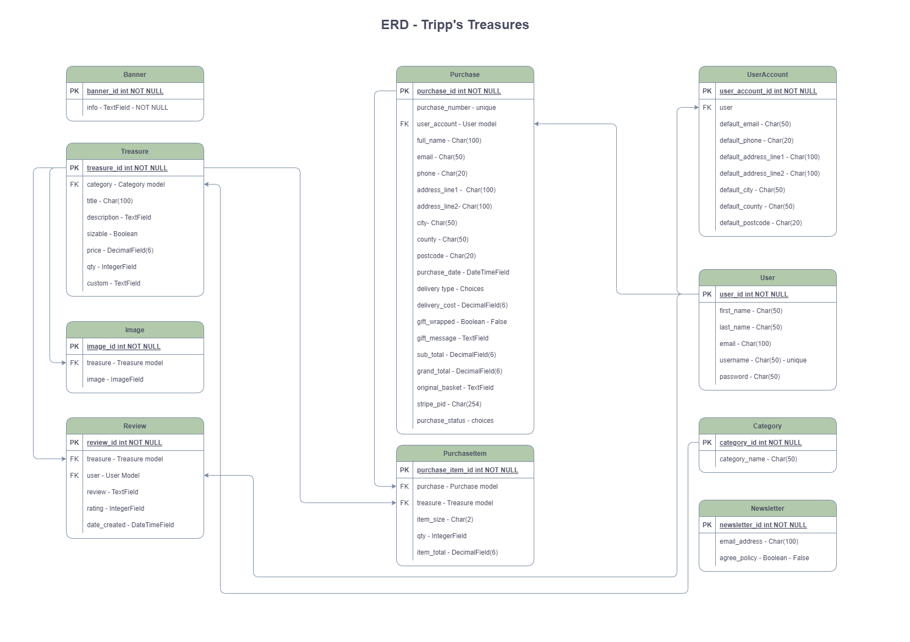

# Tripp's Treasures

Tripp's Treasures is an online e-commerce boutique, selling hand crafted homewares and baby clothes.
Customers can request customisation of each item, making them ideal gifts for friends or loved ones.

-responsive image-

-link to live site with instructions-

## UX
### User Stories

#### User Goals

* As a site visitor I would like to:
  * Be able to navigate the site without needing to register or login.
    * The site should be intuitive and easy to navigate.
    * I would like to be able to find what I'm looking for by selecting relevant categories.
    * I would like to be able to filter the products available to suit my needs.
    * I would like to be able to find what I need by use of a search bar.
    * I would like to be able to view snapshots of products to easily find products of interest.
    * I would like to be able to view a the full details of a product including, multiple images, full description, sizing information (if necessary), pricing, user ratings, and FAQs.
    * I would like to be able to view related sites without having to find them with a search engine.
  * Be able to select a product(s) to purchase.
    * I would like to be able to select sizes for clothing.
    * I would like to select the quantity of products.
    * I would like to be able to request customizations of the products available.
    * I would like to be able to add the selected product(s) to my basket without being automatically directed to it.
  * Be able to review my purchaces before committing to buy.
    * I would like to be able to access my shopping basket from anywhere on the site.
    * On accessing my shopping basket I would like to see a cost breakdown of my selected purchases.
    * I would like to be able to amend or remove any items before committing to buy.
  * Be able to checkout of the site and pay for my purchases.
    * I would like to be able to enter my personal information in a secure environment.
    * I would like to be given the option to not have to repeat myself when entering personal information.
    * I would like to have the option to register with the site to save my personal information for a faster checkout next time I visit the site.
    * I would like to have the option to have my order sent to a different address to the billing address.
    * I would like to have the option to add a gift tag and have the items wrapped.
    * On submitting my order, I would like to receive a confirmation email with my order details and a unique order number.
    * I would like to receive a dispatch confirmation email with and estimated delivery date.
* As a registered site visitor I would like to:
  * Have the option to login with a social media account for a speedier "1 click" login.
  * Be able to access my account/profile page.
    * I would like to be able to view my personal information. update and delete personal information.
    * I would like to be able to update my personal information. update and delete personal information.
    * I would like to be able to delete my personal information.
    * I would like to be able to view my order history and any current orders to track progress.
    * I would like the option to delete my account.
  * Be able to publish reviews of products I have received.
    * I would like to be able to create a review.
    * I would like to be able to update a review.
    * I would like to be able to delete a review.
  * Be able to contact the site owner by means of a contact form.
* As a newsletter subscriber I would like to: 
    * Have the option to unsubscribe from the newsletter.

#### Site Owner Goals

* As the site owner I would like to:
  * Provide a site that's highly accessible to all customers.
  * Be able to advertise any offers or relative information to customers by means of an information banner.
  * Be able to gather subscribers for my newsletter by advetising the link on the site.
  * Be able to manage products.
    * I would like to be able to add new products to the site.
    * I would like to be able to update existing products.
    * I would like to be able to delete existing products.
  * Be able to view my workload.
    * I would like to be able to view all current orders in production sorted by date ordered.
    * I would like to be able to change the status of an order when the product has been created.
    * I would like to change the status of an order when the product has been dispatched.

## Design (UXD)

### Strategy
#### Project Goal

Create an e-commerce website to help a friend sell her handcrafted, customisable gifts to a wider audiance by utilising SEO techniques.

* __Is the content culturally appropriate?__
  * Yes. Users would only visit the site if they wanted to purchase a unique handcrafted gift.
* __Is the content relevant?__
  * Yes. All content is relevant to the project goal.
* __Can we track and catalogue the content in an intuitive way?__
  * Yes. All content is stored in a database and accessed via categories, filtering or search criteria.
* __Is the technology appropriate?__
  * Yes. The site will be created using Python and the Django framework, designed for the easy creation of full stack websites.
* __Why are we so special? What sets us apart?__
  * We offer a range of unique handcrafted gifts customised to the customer's liking.
* __Tech Considerations?__
  * The site will be built using Python with the Django framework, JavaScript & HTML. CSS will be used alongside Bootstrap for site responsiveness over different screen sizes. PostgreSQL will be used to host site information & AWS S3 will host site images. Stripe will be used to handle secure payments. The site will be hosted from Heroku and Github will be used for version control and Agile methodology.
* __Why would a user want this?__
  * A user would want to use this site to purchase unique customisable handcrafted gifts for friends or loved ones.
### Scope

* __What does the user want to accomplish?__.
  * The user wants to purchase a unique handcrafted gift, customised to thier liking.
* __What does the user need to do in order to achieve their objective?__
  * The user needs to navigate to their product of choice, choose the size (if necessary), Write a short description of how they would like the product to be customised, review their purchase, fill in the checkout form, submit payment details, and receive a confirmation of purchase email.
* __What constraints does the site/app have to fall within?__
  * A limited build time.
* __What dynamic constraints do we have to meet?__
  * Customer preferences/mind-changes for features/UI.
#### Functional Scope
Entity Relationship Diagram

#### Agile Methodology
-Link to github projects goes here-
### Structure
From the top down, the site will consist of the following:
  * A fixed info banner at the top of the page.
  * Medium screens and greater:
    * Navbar with site logo and title.
    * Fixed categories.
    * Main content area.
    * Footer (not fixed).

  * Small screens:
    * Site logo and title (moves with scroll).
    * Sticky navbar (takes the place of the site logo and title on scroll)contains a search bar, shopping basket, and dropdown menu (account, baby clothes, gifts for her, gifts for him, gifts for pets).
    * Current category or page title + filter options (if applicable).
    * Fixed categories.
    * Main content area.
    * Footer (not fixed).
  
### Skeleton
Wireframe layouts for the site were created using [balsamiq](https://balsamiq.com/). View the wireframes [here](readme_images/wireframes.pdf).
### Surface
#### Colour Palette
#### Typography
#### Iconography
## SEO (Search Engine Optimisation)

