# Tripp's Treasures

Tripp's Treasures is an online e-commerce boutique, selling hand crafted homewares and baby clothes.
Customers can request customisation of each item, making them ideal gifts for friends or loved ones.

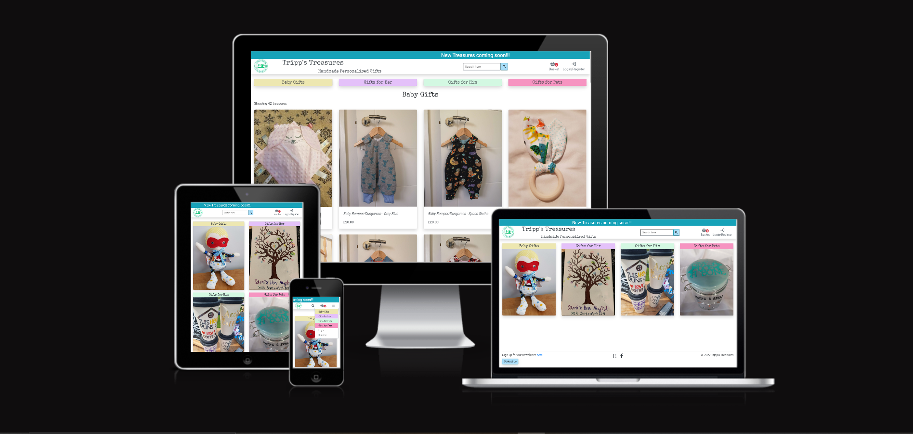

Visit the live site: https://tripps-treasures.herokuapp.com/

The site uses the [Stripe](https://stripe.com/gb) payment system. When entering payment info, enter 42424242... until you run out of space to send a mock payment (please don't use real card details).

If you wish to register or receive a confirmation email, you need to enter a real email address or generate a test email through an email generator site when registering or purchasing items.

## Contents

* [User Experience (UX)](#user-experience-ux)
  * [User Stories](#user-stories)
    * [User Goals](#user-goals)
    * [Site Owner Goals](#site-owner-goals)
* [Design (UXD)](#design-uxd)
  * [Strategy](#strategy)
    * [Project Goal](#project-goal)
  * [Scope](#scope)
    * [Functional Scope](#functional-scope)
    * [Agile Methodology](#agile-methodology)
  * [Structure](#structure)
  * [Skeleton](#skeleton)
  * [Surface](#surface)
    * [Colour Palette](#colour-palette)
    * [Typeography](#typography)
    * [Iconography](#iconography)
* [SEO and Marketing](#seo-search-engine-optimisation-and-marketing)
  * [SEO](#seo)
  * [Marketing](#marketing)
* [E-Commerce Business Model](#e-commerce-business-model)
* [Features](#features)
  * [Existing Features](#existing-features)
  * [Future Features](#future-features)
* [Technologies Used](#technologies-used)
* [Testing](#testing)
  * [Validator Testing](#validator-testing)
  * [Manual Testing](#manual-testing)
  * [Automated Testing](#automated-testing)
  * [Bugs and Fixes](#bugs-and-fixes)
* [Deployment](#deployment)
* [Credits](#credits)
* [Aknowledgements](#aknowledgements)

## User Experience UX
### User Stories

#### User Goals

* As a site visitor I would like to:
  * Be able to navigate the site without needing to register or login.
    * The site should be intuitive and easy to navigate.
    * I would like to be able to find what I'm looking for by selecting relevant categories.
    * I would like to be able to filter the products available to suit my needs.
    * I would like to be able to find what I need by use of a search bar.
    * I would like to be able to view snapshots of products to easily find products of interest.
    * I would like to be able to view a the full details of a product including, multiple images, full description, sizing information (if necessary), pricing, user ratings, and FAQs.
      * I would like to be able to view related products from the full product details page. 
    * I would like to be able to view related sites without having to find them with a search engine.
    * I would like to easily navigate the site on a smaller screen and access all information available to larger screen users.
    * I would like to be able to register/login to the site from any page.
  * Be able to select a product(s) to purchase.
    * I would like to be able to select sizes for clothing.
    * I would like to select the quantity of products.
    * I would like to be able to request customizations of the products available.
    * I would like to be able to add the selected product(s) to my basket without being automatically directed to it.
  * Be able to review my purchaces before committing to buy.
    * I would like to be able to access my shopping basket from anywhere on the site.
    * On accessing my shopping basket I would like to see a cost breakdown of my selected purchases.
    * I would like to be able to amend or remove any items before committing to buy.
  * Be able to checkout of the site and pay for my purchases.
    * I would like to be able to enter my personal information in a secure environment.
    * I would like to be given the option to not have to repeat myself when entering personal information.
    * I would like to have the option to register with the site to save my personal information for a faster checkout next time I visit the site.
    * I would like to have the option to have my order sent to a different address to the billing address.
    * I would like to have the option to add a gift tag and have the items wrapped.
    * I would like to pay for my purchase using a trusted payment portal.
    * On submitting my order, I would like to receive a confirmation email with my order details and a unique order number.
    * I would like to receive a dispatch confirmation email with and estimated delivery date.
  * Be able to contact the site owner by means of a contact form.
  * Be able to subscribe to a newsletter.
    * Have the option to unsubscribe from the newsletter mailing list.
* As a registered site visitor I would like to:
  * Have the option to login with a social media account for a speedier "1 click" login.
  * Be able to access my account/profile page.
    * I would like to be able to view my personal information.
    * I would like to be able to update my personal information.
    * I would like to be able to delete my personal information.
    * I would like to be able to view my order history and any current orders to track progress.
    * I would like the option to delete my account.
  * Be able to publish reviews and ratings of products I have received.
    * I would like to be able to create a review.
    * I would like to be able to update a review.
    * I would like to be able to delete a review.
    * I would like to be able to rate a product out of 5 stars.

#### Site Owner Goals

* As the site owner I would like to:
  * Provide a site that's highly accessible to all customers.
  * Be able to advertise any offers or relative information to customers by means of an information banner.
  * Be able to gather subscribers for my newsletter by advetising the link on the site.
  * Be able to manage products.
    * I would like to be able to add new products to the site.
    * I would like to be able to update existing products.
    * I would like to be able to delete existing products.
  * Be able to view my workload.
    * I would like to be able to view all current orders in production sorted by date ordered.
    * I would like to be able to change the status of an order when the product has been created.
    * I would like to change the status of an order when the product has been dispatched.
    * I would like to send an order despatched email to the customer when the order is complete.

## Design (UXD)

### Strategy
#### Project Goal

Create an e-commerce website to help a friend sell her handcrafted, customisable gifts to a wider audiance by utilising SEO techniques.

* __Is the content culturally appropriate?__
  * Yes. Users would only visit the site if they wanted to purchase a unique handcrafted gift.
* __Is the content relevant?__
  * Yes. All content is relevant to the project goal.
* __Can we track and catalogue the content in an intuitive way?__
  * Yes. All content is stored in a database and accessed via categories, filtering or search criteria.
* __Is the technology appropriate?__
  * Yes. The site will be created using Python and the Django framework, designed for the easy creation of full stack websites.
* __Why are we so special? What sets us apart?__
  * We offer a range of unique handcrafted gifts customised to the customer's liking.
* __Tech Considerations?__
  * The site will be built using [Python](https://www.python.org/) with the [Django framework](https://www.djangoproject.com/), [JavaScript](https://www.javascript.com/) & [HTML](https://html.com/semantic-markup/). [CSS](https://www.w3.org/Style/CSS/Overview.en.html) will be used alongside [Bootstrap](https://getbootstrap.com/) for site responsiveness over different screen sizes. [PostgreSQL](https://www.postgresql.org/) will be used to host site information & [AWS S3](https://aws.amazon.com/free/?all-free-tier.sort-by=item.additionalFields.SortRank&all-free-tier.sort-order=asc&awsf.Free%20Tier%20Categories=categories%23storage&trk=9845b571-f118-41f9-ae80-53f3364524c4&sc_channel=ps&sc_campaign=acquisition&sc_medium=ACQ-P|PS-GO|Brand|Desktop|SU|Storage|S3|GB|EN|Text&s_kwcid=AL!4422!3!489216385180!e!!g!!aws%20s3&ef_id=CjwKCAjwkMeUBhBuEiwA4hpqEJmK52Rp_outs9Ama8hbA1IhA0MOr-OkiPis4BSWVAuobKN7yEmQsRoCSNMQAvD_BwE:G:s&s_kwcid=AL!4422!3!489216385180!e!!g!!aws%20s3&awsf.Free%20Tier%20Types=*all) will host site images. [Stripe](https://stripe.com/gb) will be used to handle secure payments. The site will be hosted from [Heroku](https://id.heroku.com/login) and [Github](https://github.com/) will be used for version control and Agile methodology.
* __Why would a user want this?__
  * A user would want to use this site to purchase unique customisable handcrafted gifts for friends or loved ones.
### Scope

* __What does the user want to accomplish?__.
  * The user wants to purchase a unique handcrafted gift, customised to thier liking.
* __What does the user need to do in order to achieve their objective?__
  * The user needs to navigate to their product of choice, choose the size (if necessary), Write a short description of how they would like the product to be customised, review their purchase, fill in the checkout form, submit payment details, and receive a confirmation of purchase email.
* __What constraints does the site/app have to fall within?__
  * A limited build time.
* __What dynamic constraints do we have to meet?__
  * Customer preferences/mind-changes for features/UI.
#### Functional Scope
Entity Relationship Diagram

#### Agile Methodology
The development of this project was managed with Agile Methodology, utilising [GitHub's](https://github.com/) Milestones tool to manage Epics, the Issues tool to manage User Stories, and the Projects tool to map out the User Stories on a Kanban board.
* The project can be viewed [here](https://github.com/mwarddev/tripps_treasures/projects/1).
* The Epics can be viewed [here](https://github.com/mwarddev/tripps_treasures/milestones).
* The User Stories can be viewed [here](https://github.com/mwarddev/tripps_treasures/issues).
### Structure
From the top down, the site will consist of the following:
  * A fixed info banner at the top of the page.
  * Medium screens and greater:
    * Navbar with site logo and title.
    * Fixed categories.
    * Main content area.
    * Footer (not fixed).

  * Small screens:
    * Site logo and title (moves with scroll).
    * Sticky navbar (takes the place of the site logo and title on scroll)contains a search bar, shopping basket, and dropdown menu (account, baby clothes, gifts for her, gifts for him, gifts for pets).
    * Current category or page title + filter options (if applicable).
    * Fixed categories.
    * Main content area.
    * Footer (not fixed).
  
### Skeleton
Wireframe layouts for the site were created using [balsamiq](https://balsamiq.com/). View the wireframes [here](readme_images/wireframes.pdf).
### Surface
#### Colour Palette
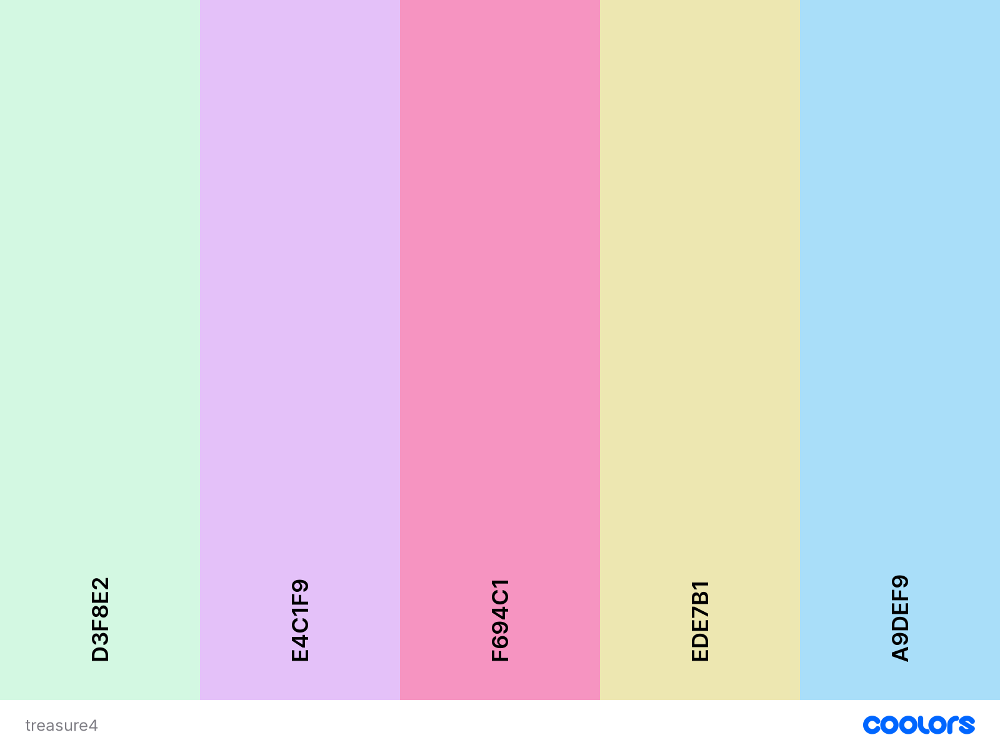
The colour palette for this site was generated using [coolors.co](https://coolors.co/).
#### Typography
The typography for this site has been selected from [Google Fonts](https://fonts.google.com/). The Special Elite font has been selected for headers and the Roboto font has been selected for all other text.
#### Iconography
The site logo was created by Sherry Tripp, the site owner. All other iconograpy has been obtained from [Font Awesome](https://fontawesome.com/). 
## SEO (Search Engine Optimisation) and Marketing
### SEO
Keywords and phrases entered as metadata in the head of the HTML document and throughout the main content of the site helps search engines find relevant, searchable content.

View the SEO keywords and phrases brainstoming session [here](readme_images/seo_keywords.pdf). The highlighted words and phrases ranked higher in a Google search and so were used in the site.
The footer contains links to the site owner's [Facebook Business page](https://www.facebook.com/business/pages) 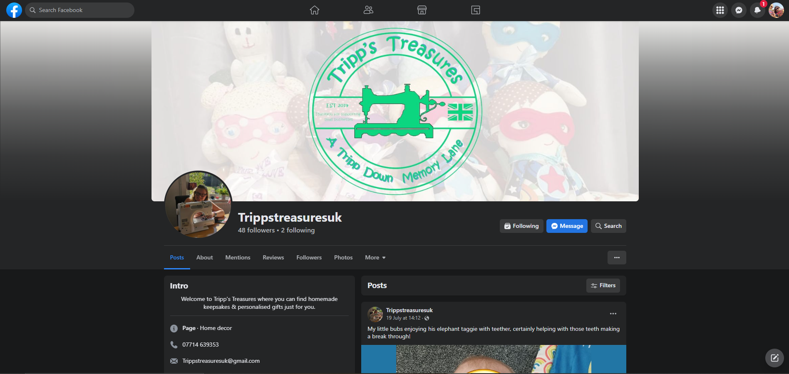 and [Etsy](https://www.etsy.com/uk/?ref=lgo) page. 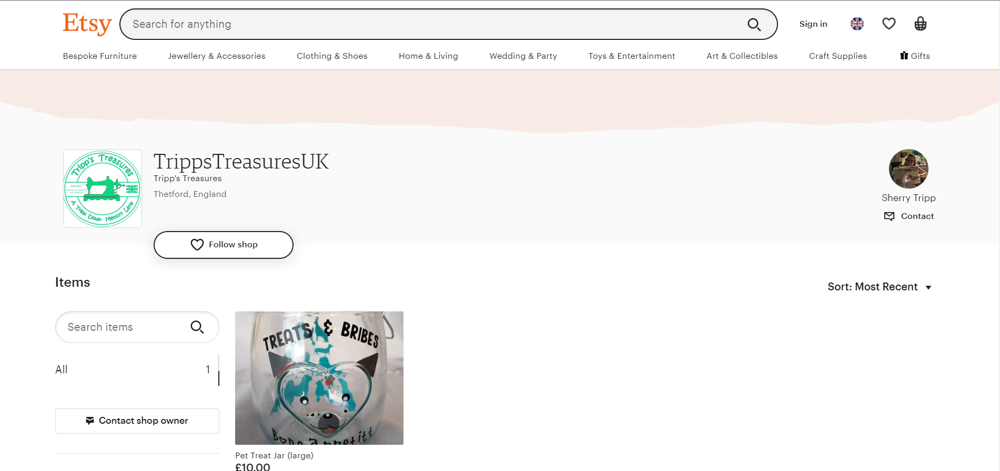

### Marketing
In the footer of every page, site visitors can find a link to sign up to to The Tripp's Treasures newsletter.
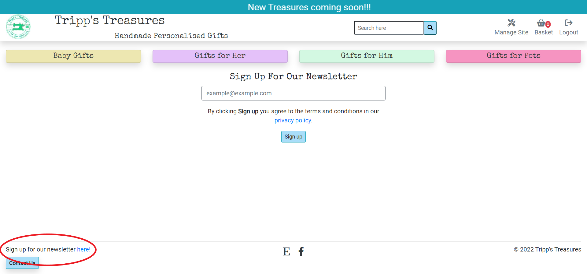
By simply adding their email address to our mailing list via the linked form, visitors agree to the terms and conditions set out in our [privacy policy](https://www.privacypolicygenerator.info/live.php?token=uRgiA5wGZgVmzSSFHNY8awreHsX1K50b), generated by [Privacy Policy Generator](https://www.privacypolicygenerator.info/).
A newsletter is a great way to share information about upcoming products and events, and site visitors don't need to login to the site to sign up for the newsletter.

Also in the footer, site visitors can find external links to the related [Facebook Business page](https://www.facebook.com/business/pages) and [Etsy page](https://www.etsy.com/uk/?ref=lgo), where can view information about previous, and future, events and products.

## E-Commerce Business Model
This site is a B2C (business to customer) e-commerce website built for a small independant retailer to sell her handmade products online.

By utilising SEO and marketing techniques, and advertising her USP (unique selling point) of handmade personalised gifts, the site owner aims to increase her client base and expand her business.

As the products are handmade to order, there are no stock levels to control. However, there is a purchase list feature available to the site owner to work from and to manage orders. A notification email is sent to the customer on purchase with a summary of their order and there's scope for further site enhancements in the [Future Features](#future-features) section.

For this site the database will need to store product details such as, name, description, images, sizing, price, available customisations/personalisations. It will need to store customer information such as, name, address, email address, phone number, and will also need to include order details, such as product quantity, sizing, costs etc.  

Customers will pay a one time payment for their order which incorporates product price and delivery costs.

## Features
### Existing Features

#### Info Banner
The first feature on every page is the scrolling info banner.

This is the first item that most people will see when they enter the site as the scrolling text is eye-catching. The info banner is to be used to promote future features, products, events, and existing offers. The site owner has exclusive access to the banner and can change the text with a simple form.
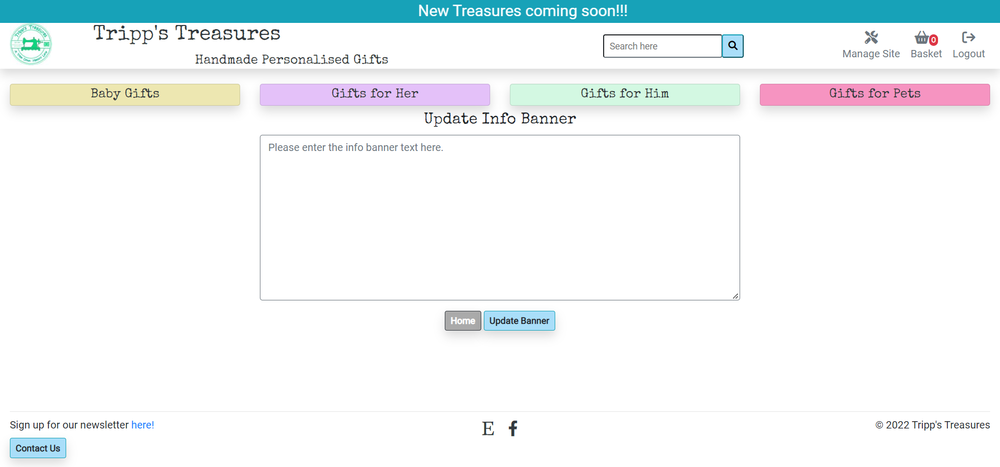

#### Dynamic Navigation bar
The navigation bar changes depending on user login, user status, and screen size.

Not logged in:
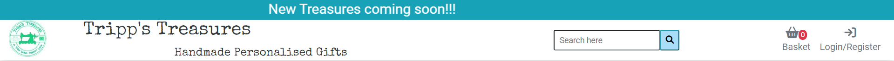

Customer logged in:

Superuser logged in:
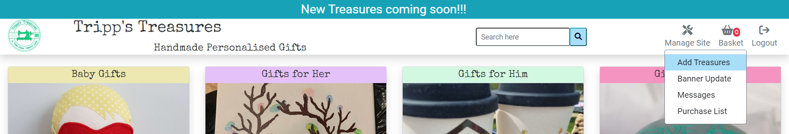

Medium screens:
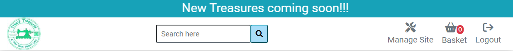

Small screens:
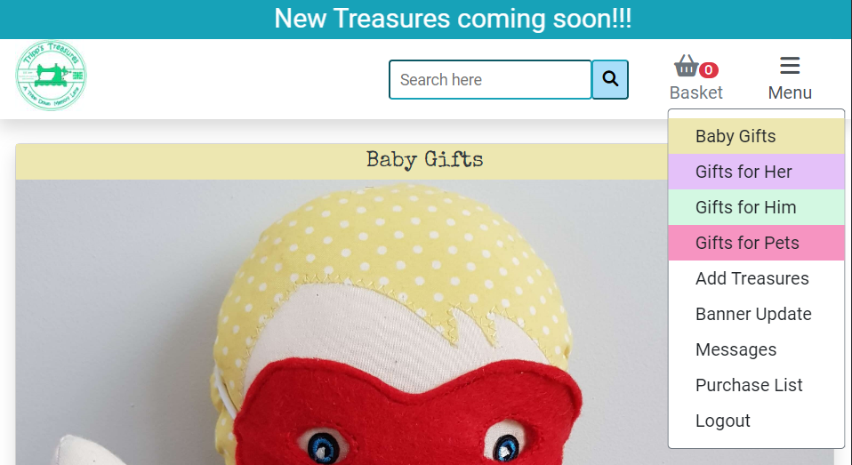

Mobile Screens:
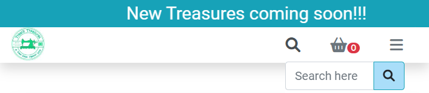

Smaller screens condence the navbar icons and category nav buttons into one dropdown menu, giving more screen real estate to content.

#### Footer
The footer contains a link to the site's newsletter signup page where anyone can register their email address and join the mailing list for the site's newsletter. There's also a link to the site's privacy policy, to be read before submitting their email address.

The footer also contains a Contact Us button for anyone who wishes to query the site owner about products, and (post payment) customisations.
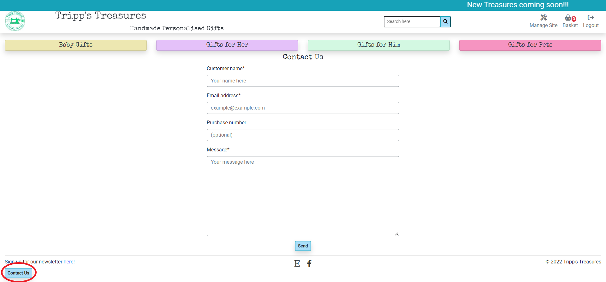
Susequently, the site owner can view the messages from the Manage Site menu.
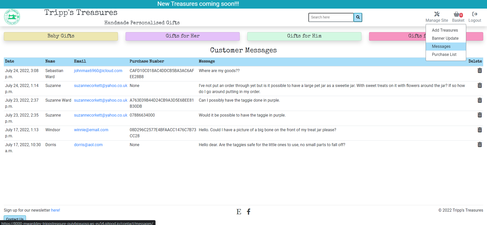
Clicking a customer's email address will open the devices default email application.

Finally, the footer houses links to external sites with relevant connections. In this case we have a link to the site owner's [Etsy page](https://www.etsy.com/uk/?ref=lgo) and [Facebook Business page](https://www.facebook.com/business/pages).
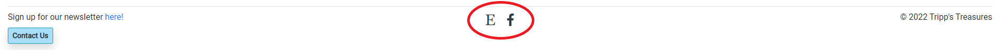

#### You May Also Like
In the product full details page, to the right (on large screens, underneath on smaller screens), of the full product, there is a related product section to entice the customer to by something they may not have been originally looking for. The product is selected randomly from the same category as the product they selected.
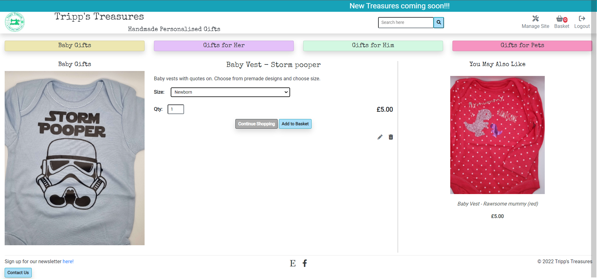

#### User Account
Registered users have the option of saving their information at the checkout page. This is then stored for the next time the user makes a purchse and speeds the whole process up.
The stored information can be viewed and edited in the user's account. The user can also view their purchase history.
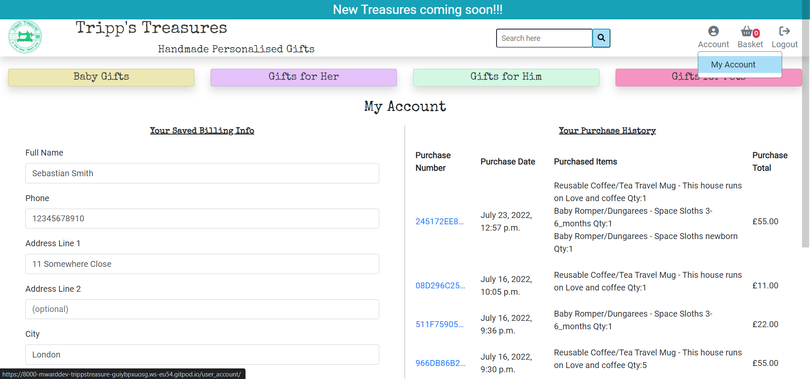
Each purchase can be selected and viewed.
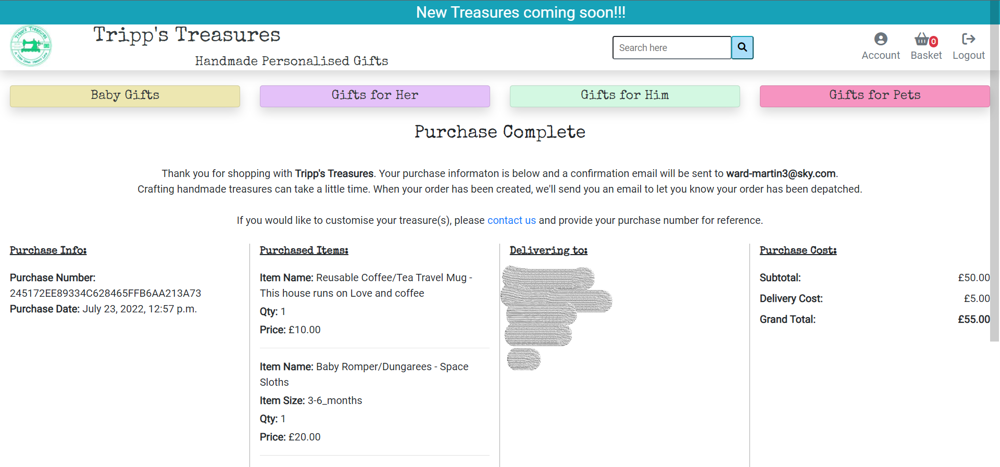

#### Purchase List
In order for the site owner to create the orders, she needsto know what they are. The purchase list output's a list of all orders with all the information needed to manage production.
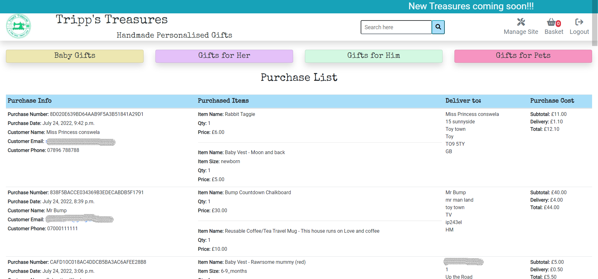

#### Add Products
To give the site full CRUD functionality, the site owner is able to add new products to the site using the Add Treasures form in the Manage Site dropdown list.
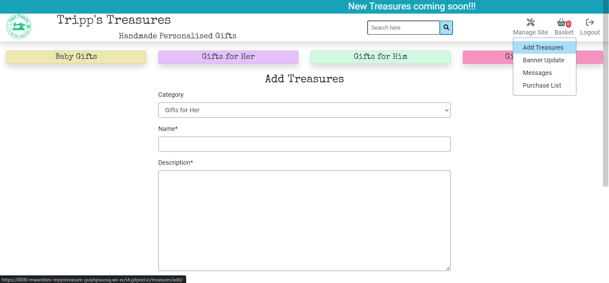

#### Edit/Delete Products
To complete the CRUD functionality the site owner can edit and delete products. This can be done from 2 locations, the treasures list:
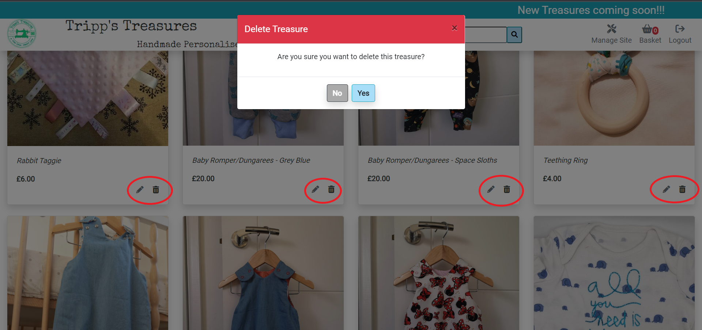
Clicking the bin icon will trigger a delete confirmation modal and clicking the pencil icon will redirect to the edit product page.
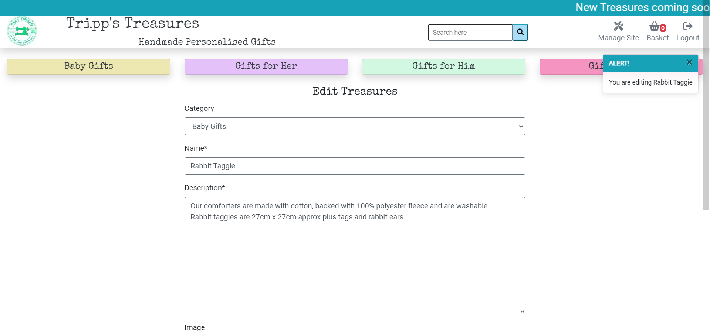
The edit form is pre-populated with the existing data to be updated.
Edit and delete can also be actioned from the product full details page.
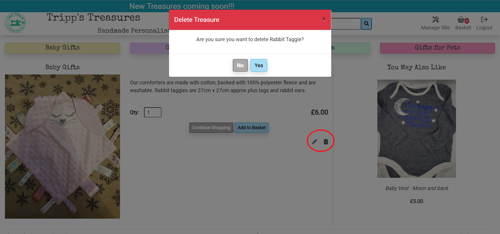

### Future Features
This site has scope for a myriad of features that were unable to be implemented in the time frame of the build. These include:

#### Multiple images
Each product can be better advertised if the customer can see it in several different contexts, either being used or displayed in different locations/situations, making the product more relatable. This could be implemented with an image carousel on the product full details page.

#### Customisation & Personalisation
The ability to add customisation and or personalisation to the product in the product full details page (instead of post purchase via a contact form) would improve the user experience of the site.

#### Ratings and reviews
Giving customers the abilty to rate and review the products improves the site's marketing. More customers are likely to purchase products if they've read good reviews about the product and the service other customers have received.

#### Gift wrapping
The site is all about unique gifts, so why not send the item(s) to the recipient wrapped and with a gift tag. This option could be selected at the checkout.

#### Shipping
Not all customers buy gifts in advance, and with next day deliveries rapidly becoming the norm, and with this business creating each order by hand, it's already on the back foot. The option to select a faster courier sevice at the checkout could appeal to customers in a rush.

#### Estimated delivery times
Collecting production data of build times for products would allow for a calculated estimate of delivery, taking the current purchase list into account. This would improve the customer's user experience.

#### Feature Rich Purchase list
The purchase list is the site owners work-to-list and anything that can be done to track production and manage orders is a must to ensure the products reach the customer in the shortest time possible. Giving each order a changable status, the list can be automatically sorted and orders prioritised. Notifications could be sent to the site owner if an order has idled for too long, and despatched emails sent to the customer on change of status.

#### In-Site Emailing
Instead of the site owner having to use an external email platform and copy pasting customer details, a light weight emailing sevice could be set up within the site. This also allows for new message alerts within the site, allowing the site owner to better monitor communication.

This list is not exhaustive.

## Technologies Used
## Testing
### Validator Testing
### Manual Testing
### Automated Testing
### Bugs and Fixes
## Deployment
## Credits
## Aknowledgements

